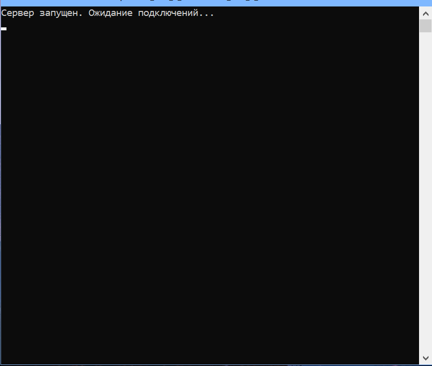
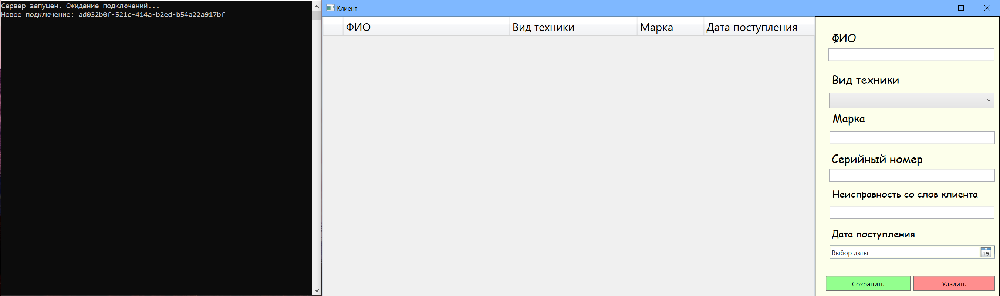
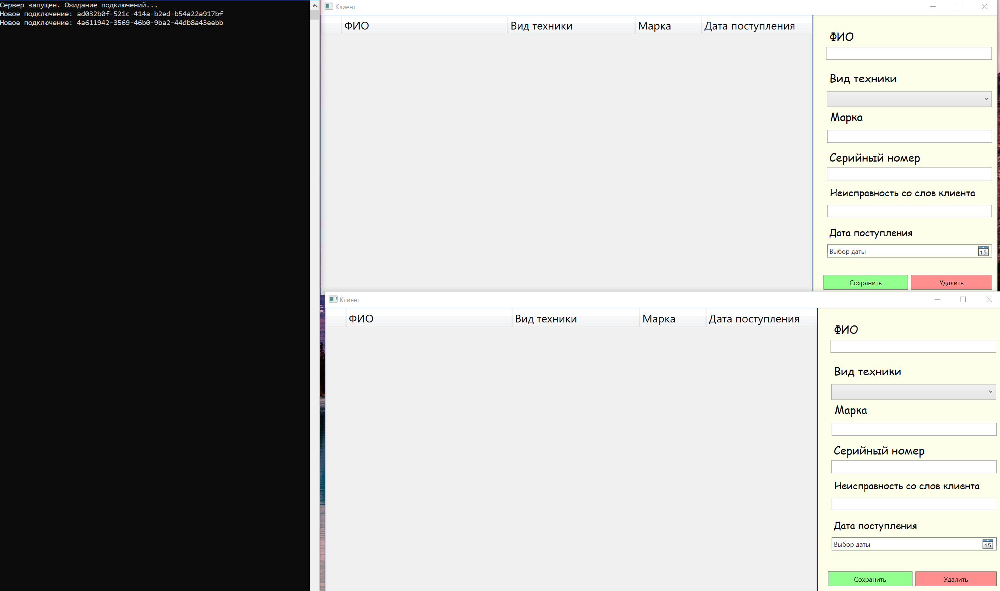

 
 

# Онлайн таблицы

## Описание 

Приложение с клиентской частью написано на C#, сервер так же написан на C#.

Связь между клиентом и сервером осуществляется по средствам протокола TCP/IP.

После обновления таблицы в одном из клиентов, данные отправляются на сервер в формате JSON.

Сервер обновляет свою текующую запись JSON и рассылает всем клиентам, для обновления таблицы.

Количество клиентов ограничивается только мощностью компьютера на котором запущен сервер.

## Пример работы с приложением

* Запуск сервера

* Запуск первого клиента

* Запуск второго клиента

**Примечение: клиент может быть и один**

* Создание записи в клиенте

	
	Как можем заметить, во втором клиенте появилась точно такая же запись.
	
* Попробуем отредактировать текущую запись из клиента получившего сообщение

	Запись успешно обновилась.
	
* Подключение третьего клиента

**Сгенерируем ситуацию когда N-ый клиент подключается во время работы.**

	После редактирование записи снова обновились во всех клиентах, 
	так же сервер оповестил о новом подключении.
	

## Тонкости интерфейса клиента

* Текст для хранения поддерживает как английский так и русский язык.

* Строку в таблице можно выбрать целиком (двойной щелчок), так и отдельную ячейку.

* После выключения сервера, все клиенты закрываются, дабы избежать ошибок от пользователя.

* Если файл в формате .JSON имеет записи с прошлого сеанса, при следующем запуске приложения сервер отправит их клиенту.

* Пользователь может не указывать текущую дату записи в таблице, она выставится автоматически относительно времени ПК на котором запущено приложение.

* Если записей становится слишком много и оне не умещаются в окно приложения, справ апоявляется полоса прокрутки.

* В приложении поддерживается Добавление/Обновление/Удаление записи.

## Скачать 

Серверное приложение - <https://disk.yandex.ru/d/XMSuxPbdnV_sqw>

Консольное приложение - <https://disk.yandex.ru/d/wJQPoD4nBBVprg>

По данным ссылкам можно найти откомпилированное приложение содержащие исполняемый файл.